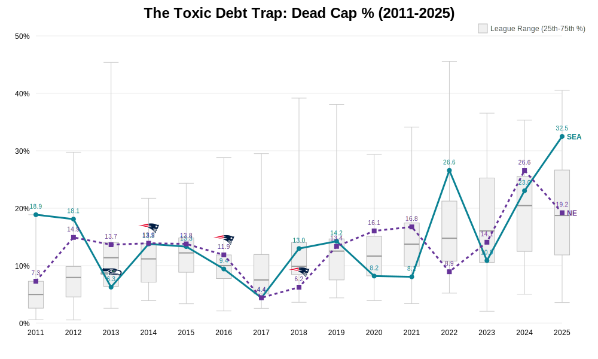
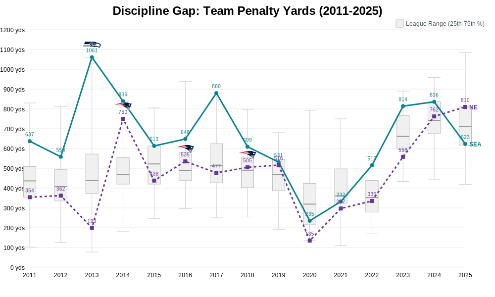
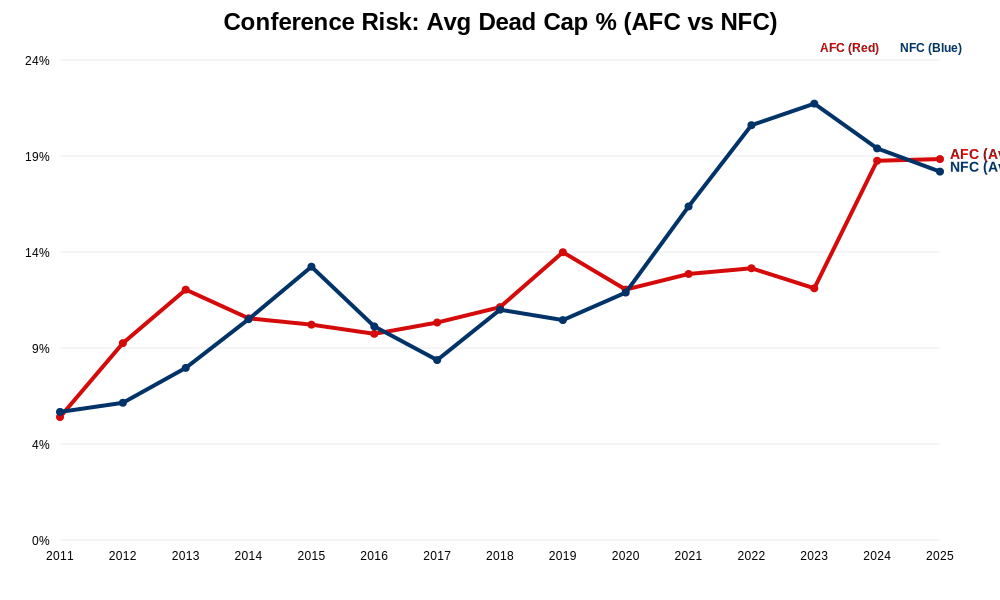
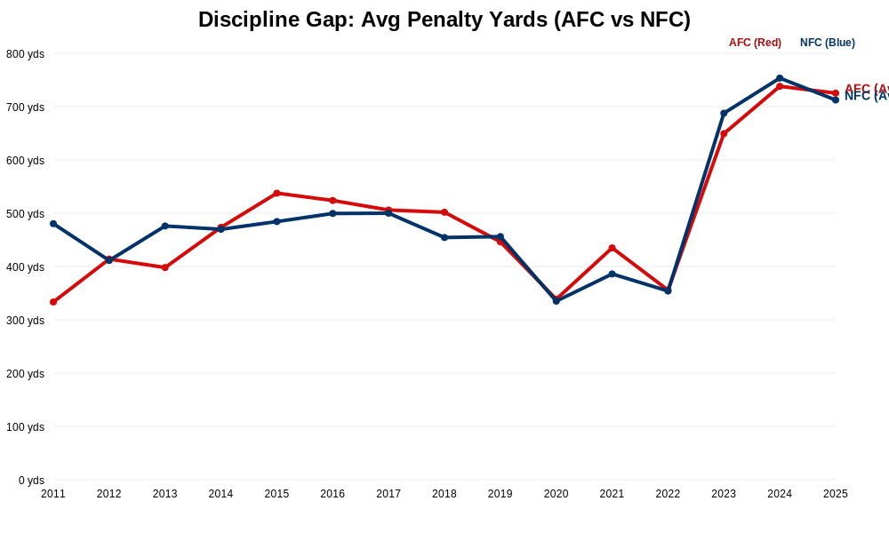
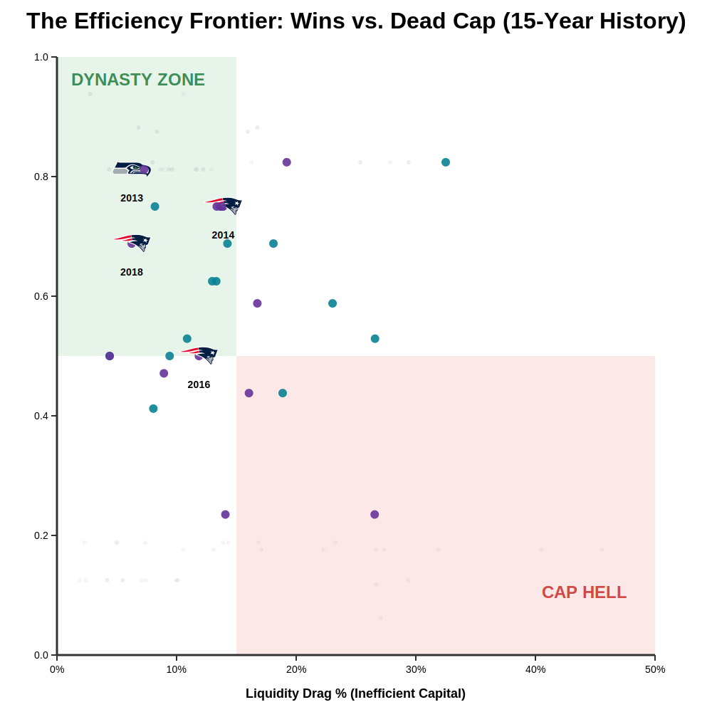

# 🏈 NFL Quantitative Risk Visualization (2011-2025)

## The "CBA Era" Longitudinal Study (15 Years)
Visualizing the divergence in risk management strategies between elite franchises and the rest of the league.
**Focus:** Super Bowl LX Contenders (Seattle vs. New England).

### 1. The Toxic Debt Trap (Dead Cap %)
*   **Metric:** Percentage of Total Cap allocated to players no longer on the roster.
*   **The "League Distribution" (Box Plots):** The grey boxes show the 25th-75th percentile range for the entire league.
*   **New England (Purple):** Notice the rigorous discipline (low variance) typical of the Belichick/Post-Belichick era structure.
*   **Seattle (Green):** Shows the volatility of the post-LOB rebuild cycles.
*   **Historical Context (2011-2025):** We now track the full "Modern Cap Era" since the 2011 CBA.

### 2. The Discipline Gap (Penalty Yards)
*   **Metric:** Total Penalty Yards per Season.
*   **Correlation:** Championship teams consistently operate in the bottom quartile of penalty yardage.
### 3. Conference Wars: AFC vs. NFC (2011-2025)
**Hypothesis:** Does one conference play "looser" with risk?

*   **Dead Cap Risk:** Tracking the average Dead Cap % allocated by AFC vs NFC teams.

*   **Penalty Discipline:** Comparing the average penalty yardage per season between conferences.

### 4. The "Efficiency Frontier" (Wins vs. Dead Cap)

This scatter plot is the ultimate "Front Office Report Card." It maps every team season from 2011-2025 to determine who buys wins efficiently and who pays for mistakes.

*   **Top-Left (Elite Dynasty):** Teams that win consistently while managing their cap well. Notice how often **New England** and early **Seattle** appear here.
*   **Bottom-Right (Cap Hell):** Teams paying players to *not* play for them while also losing games. This is the "fireable offense" quadrant.

### 5. League Landscape 2024: The Playoff "Cut Line"

This snapshot shows the operational status of all 32 teams for the 2024/2025 season.
*   **Gold Highlights:** 2024 Playoff Teams.
*   **Faded:** Non-Playoff Teams.

**Key Insight:** Notice how almost every Gold Circle (Playoff Team) resides in the "Dynasty Zone" (Green). The "Cap Hell" quadrant (Red) is populated almost exclusively by faded, non-playoff teams.
