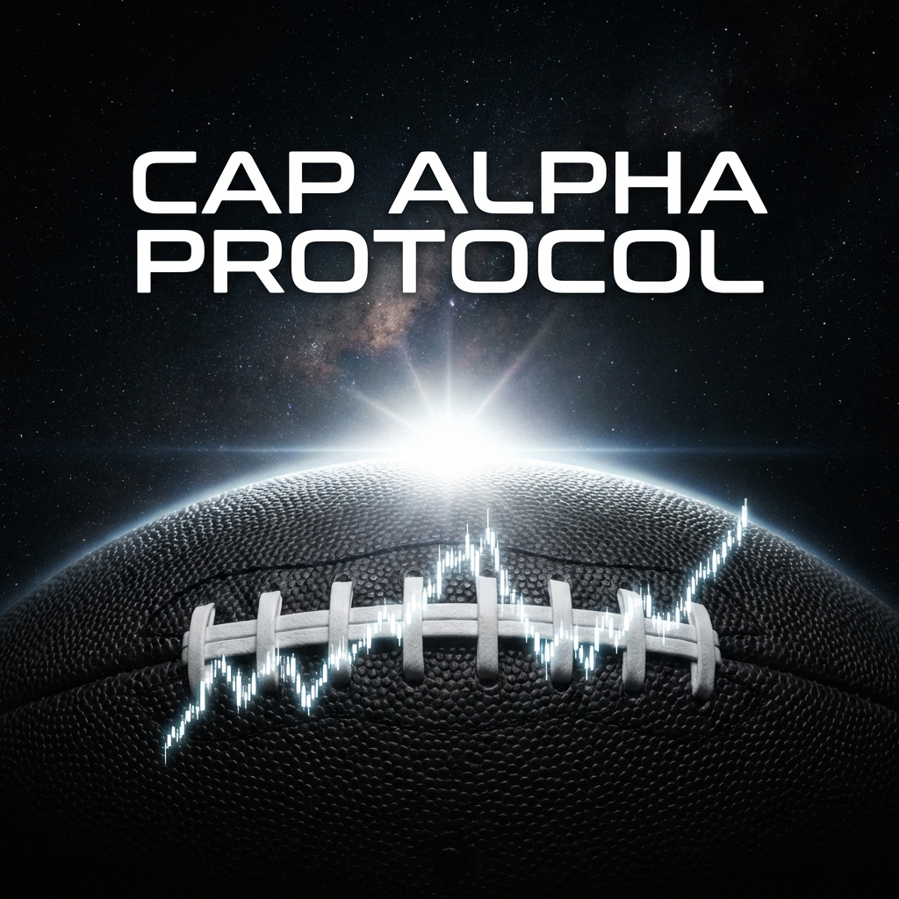
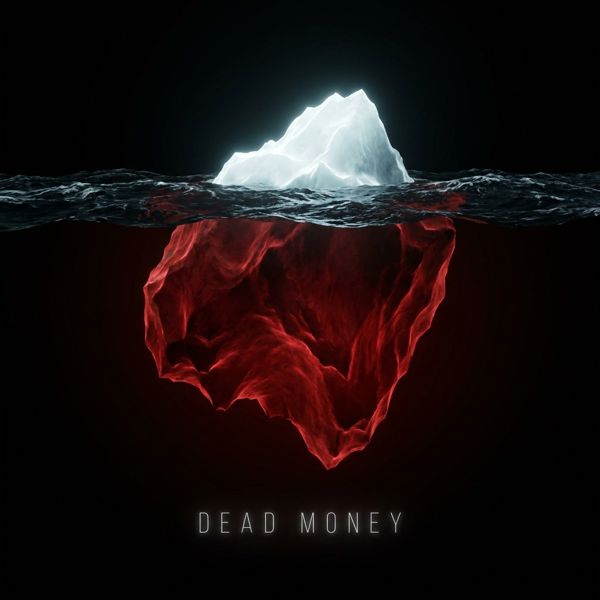
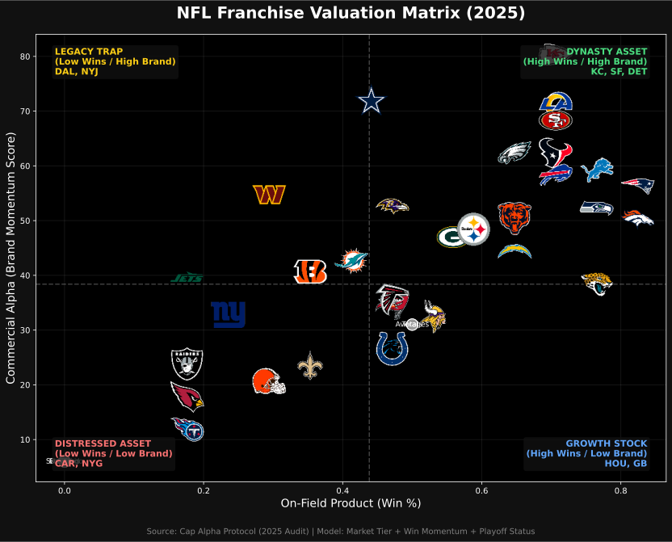
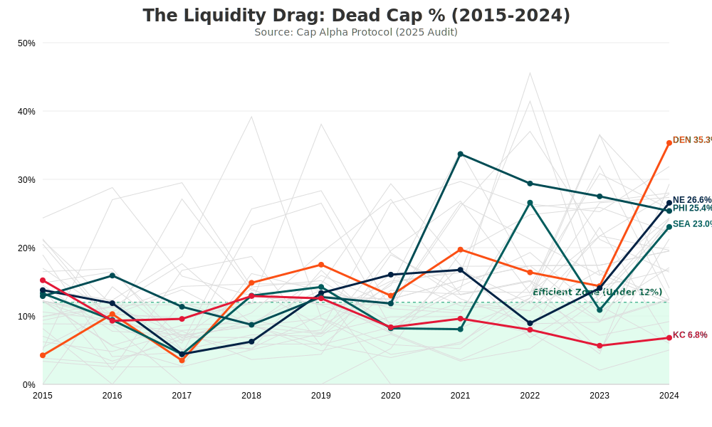

# Cap Alpha Protocol: Visual Asset Deck (FINAL)
**Date:** 2025-02-05
**Status:** RELEASED (Assets Cleaned)

---

## 🏆 THE HERO ASSET: "The Orbital Sunrise"
**Concept:** The Trend (Enhanced)
**Use Case:** LinkedIn Header, Substack Cover, Pitch Deck Title Slide.

---

## Secondary Asset: "The Iceberg"
**Concept:** The Metaphor
**Use Case:** Explaining "Dead Money" vs "Cap Hit". Identifying the hidden risk.

---

## Production Artifacts
*Live Data Visualizations (Regenerated Daily)*

### Exhibit A: The Valuation Matrix

### Exhibit B: The Risk History

