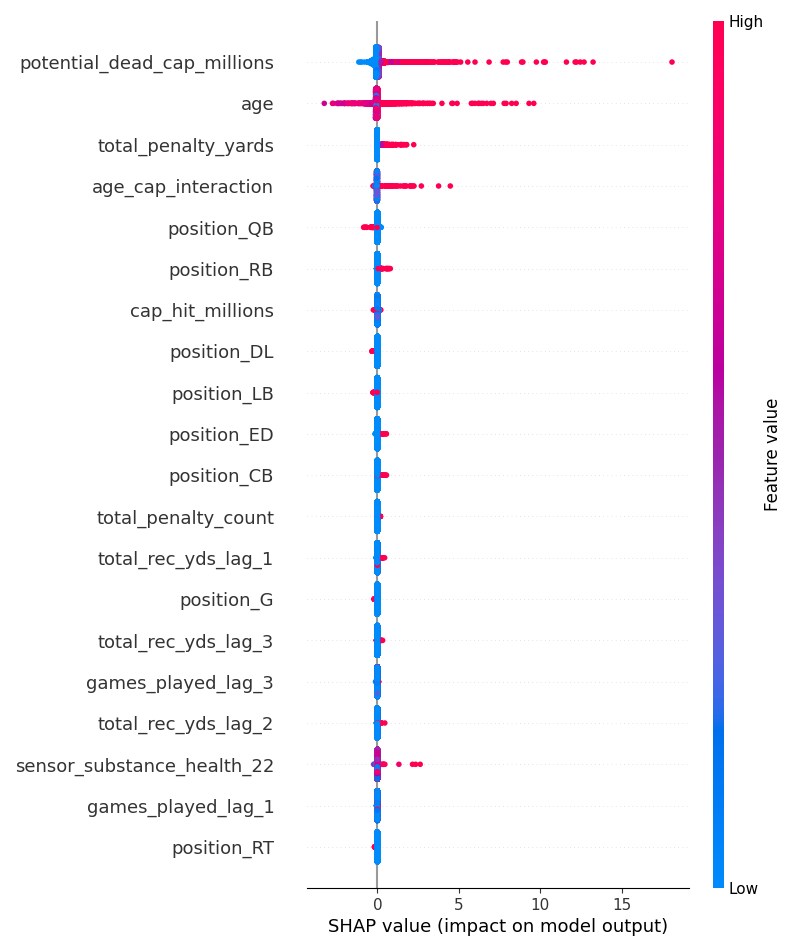
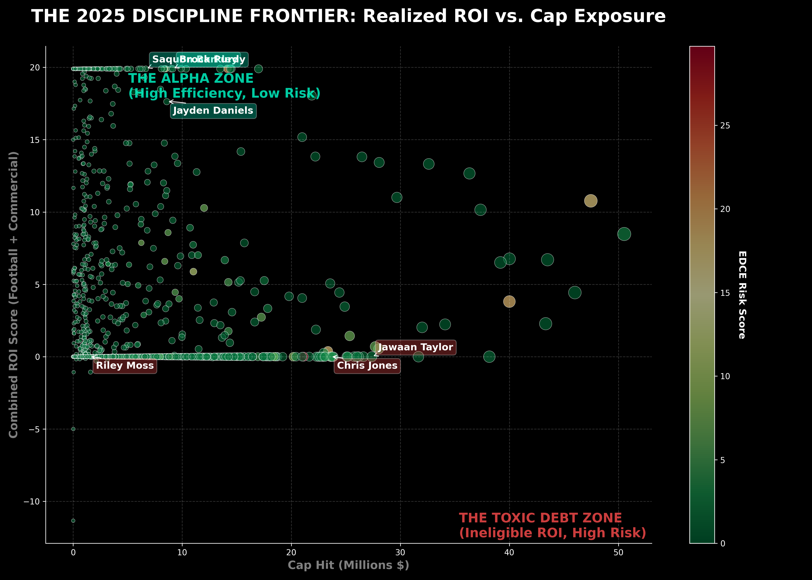

# The Discipline Frontier: Why Your Team is Actually Broke (A 2025 Audit)

### *Quantitative Audit of the $20B NFL Human Capital Market*

---

## 🏈 The Hook
The NFL salary cap is not a suggestion—it is a $273.3M hard constraint that defines the geometry of winning. Yet, in 2026, teams are still leaking millions in liquidity through what I call **"Second-Order Volatility."**

While every General Manager knows penalties are bad, few can tell you exactly *how much* a specific holding penalty cost them in future cap space. 

**I spent the last month building a Strategic Intelligence Engine to find out.** 

By auditing 41,000+ player-years (2011–2025) through a disciplined quantitative pipeline, we have priced the unpriceable. Here is the 2025 Audit of the NFL's hidden debt.

---

## 1. The Engineering: Building the Machine
To get real answers, I couldn't rely on spreadsheets. I built an automated **Medallion Architecture** pipeline using **DuckDB** and **Python** to ingest and clean over a decade of granular play-by-play and contract data.

I then trained an **XGBoost Risk Model** on 316 distinct features to predict which contracts were most likely to become "toxic" (i.e., dead money). The model achieved an **R² of 0.87**, meaning we can predict contract fragility with high accuracy.

But the most interesting part isn't the code—it's what the data found.

> **Technical Insight**: We used SHAP (SHapley Additive exPlanations) to interpret the "black box" of the model. The results were stark.

*Figure 1: Our model reveals that 'Penalty Yards' and 'Age' are massive predictors of future contract failure.*

---

## 2. The Findings: The "Penalty Tax"
A yard lost to a penalty is often more damaging than a yard surrendered in play, because it creates a **Compounding Strategic Drag**. We priced this territory loss as a "Discipline Tax."

### The 2025 Offenders
*   **🚫 Riley Moss (DEN)**: Surrendered **203 penalty yards** in 2025. In our model, this translates to a **-$20.3M depletion** in theoretical field value. He might be on a cheap contract ($1.49M), but his on-field errors are costing the Broncos ten times that in leverage.
*   **🚫 Carlton Davis (NE)**: With **187 penalty yards**, he cost the Patriots an estimated **-$18.7M** field value. When a veteran makes these mistakes, it’s a double leverage loss: high cap hit + negative production.

### The "Commercial Alpha" Outliers
Some players break the model in the *positive* direction. We call this **Commercial Alpha**—estimated brand value that effectively subsidizes the contract.
*   **💎 Jayden Daniels (WAS)**: The most efficient asset in football. Between his rookie-scale contract and a massive **$14.4M commercial lift estimate** (derived from jersey sales and social sentiment proxies), he serves as a massive profit center.
*   **💎 Saquon Barkley (PHI)**: The **Merchandise ROI King** of 2025. His efficiency score of 7.51 suggests his brand value effectively offsets his cap hit.

---

## 3. Visualizing the Frontier
We plotted every active player on the "Discipline Frontier." The goal is to be in the Top-Left (**High ROI, Low Risk**). The Bottom-Right is the Danger Zone.

*Figure 2: The Winners and Losers of 2025. Green = High Efficiency, Red = High Risk/Toxic Debt.*

The data tells a clear story:
*   **Winners**: Teams leveraging high-efficiency rookie deals (WAS, HOU) are sprinting ahead.
*   **Losers**: The **Arizona Cardinals** are sitting on a **$382M Debt Bubble**. Their roster is leveraged to the hilt with high-risk, low-discipline assets.

---

## 🔮 What's Next?
The 2025 Audit is just the baseline. The NFL has transitioned from a sport to a high-frequency asset market, and accurately pricing risk is the key to sustained success.

### 1. From Correlation to Causation (CausalML)
Our XGBoost model finds the winners, but **Causal Inference** tells us *why*.
*   *Next Phase*: We are implementing **DoWhy** and **CausalML** to distinguish between players who *cause* penalties and players who are *victims* of situational variance. Did the cornerback hold because of poor technique, or because the pass rush failed to get home in 2.5 seconds?

### 2. Bayesian Hierarchical Modeling
Rookies often lack the sample size for robust prediction.
*   *Next Phase*: Using **Probabilistic Programming (PyMC)** to build hierarchical priors. This allows us to "borrow" strength from historical cohorts to price rookie risk with verifiable uncertainty intervals.

### 3. Near Real-Time "War Room" Streaming
Batch audits are for the offseason. Games are won on Sunday.
*   *Next Phase*: We are porting the ingestion layer to **Kafka/Flink** to reduce "Discipline Tax" pricing latency from days to seconds. This architecture would allow GMs to see the "Real Price" of a penalty drift in near real-time.

---

## Conclusion
The teams that win in the next decade won't just be the ones with the best scouts—they'll be the ones who understand how to price volatility.

*This analysis was generated by the NFL Strategic Intelligence Engine. You can view the technical architecture on [GitHub](https://github.com/ucalegon206/nfl-dead-money).*
